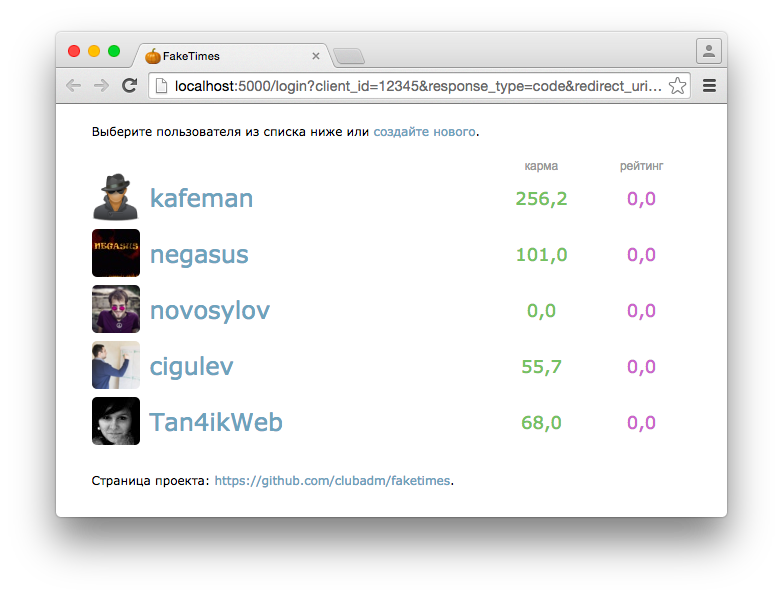
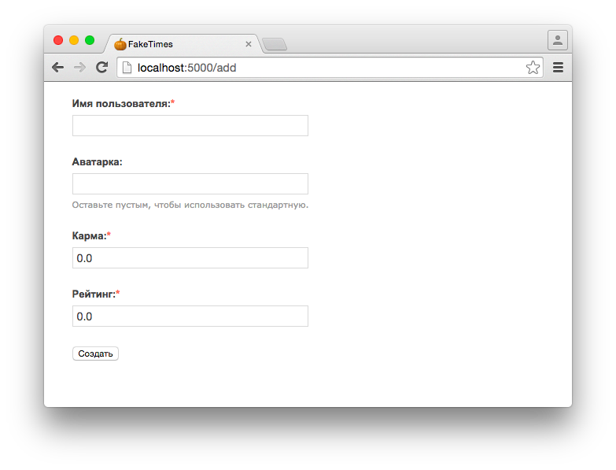

# FakeTimes

FakeTimes - это небольшое приложение на Python, которое имитирует API сайтов
[Хабрахабр](http://habrahabr.ru/) и [Geektimes](http://geektimes.ru/).

В первую очередь, FakeTimes должен помочь запускать всем желающим
OpenSource-проекты вроде [ХабраАДМ](https://habra-adm.ru/), которые намертво
приколочены к закрытому API Хабрахабра.

Кроме того, эта заглушка может упростить отладку приложений, в которых
необходима постоянная смена пользователей с различной конфигурацией
(карма/рейтинг/readonly/etc).

Для запуска достаточно python 3 и [Flask](http://flask.pocoo.org/):

```bash
$ pip install Flask
$ python faketime.py
```

## Скриншоты




